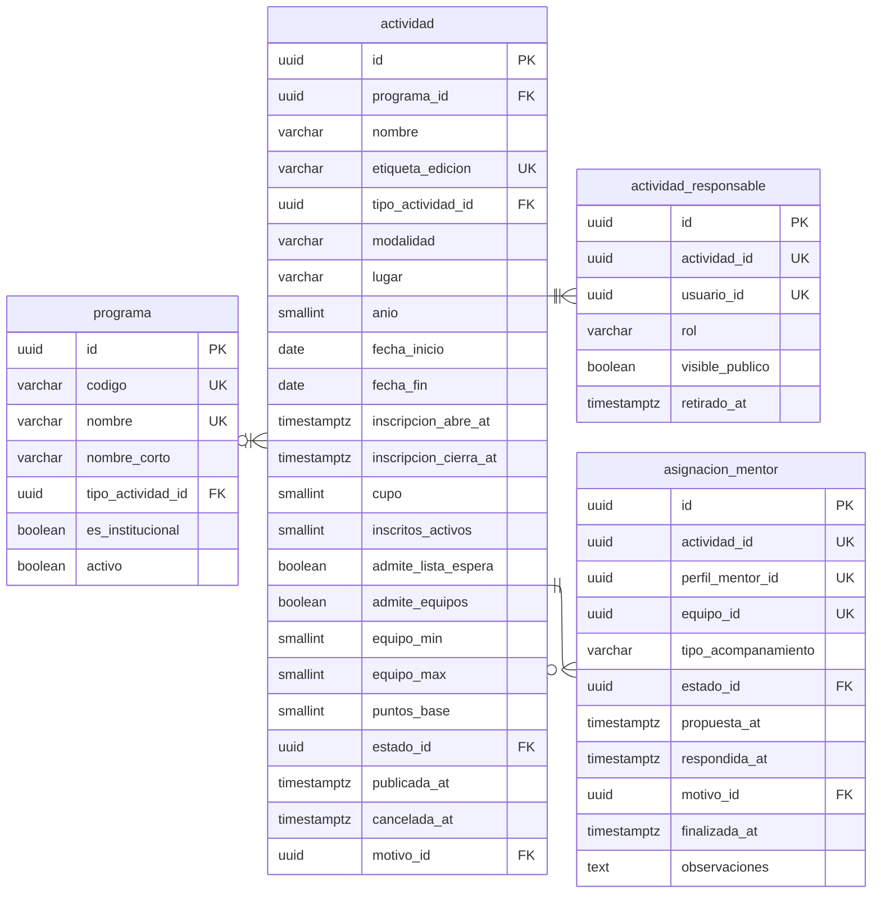

# Actividades

Cuatro tablas. `actividad` es la más ancha del modelo y la que más triggers
lleva.



---

## El invariante del cupo

```postgresql
CONSTRAINT chk_actividad_cupo_coherente
CHECK (cupo IS NULL OR inscritos_activos <= cupo)
```

`inscritos_activos` es el **único contador denormalizado del modelo**. Existe
porque `CHECK` no puede contar filas de otra tabla y el invariante tiene que ser
estructural: es el que compite bajo concurrencia real, con decenas de personas
pulsando el botón sobre los últimos lugares de un hackathon.

El trigger que lo mantiene vive en `inscripcion` y se ejecuta dentro de la misma
transacción, de modo que el `CHECK` se evalúa con el valor ya incrementado y el
sobrecupo falla como error de transacción.

---

## Notas del nivel físico

**`programa_id` es nulable.** Una charla única no es la edición de nada. Forzarla
a pertenecer a un programa crearía programas de un solo elemento.

**`anio` es columna propia y no `EXTRACT(year FROM fecha_inicio)`.** La edición
del Rally que arranca en noviembre y cierra en febrero se reporta entera en el año
que la DIEM decida, y el índice de conteo anual necesita una columna real.

**`etiqueta_edicion` es `varchar` y no llave foránea.** Las etiquetas reales de la
matriz —`Edición 2024`, `I Cohorte 2026`, `II semestre 2025`— no comparten
estructura, y un catálogo de todas las combinaciones sería más largo que la tabla
de actividades.

**`asignacion_mentor.equipo_id` es nulable y forma parte de la unicidad.**
Distingue al mentor que acompaña a un equipo concreto del que da una charla a toda
la actividad, y permite que el mismo mentor acompañe a dos equipos distintos de la
misma actividad sin colisionar.
