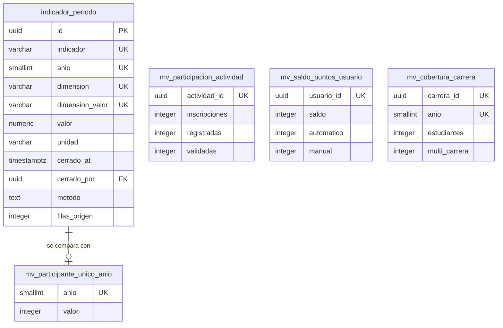

# Analítica

Una tabla y cuatro vistas materializadas. Las vistas no cuentan en el recuento de
82 porque pueden reconstruirse desde cero.

---

## Notas del nivel físico

**`indicador_periodo` es la única tabla del modelo cuyo valor está en no
recalcularse.** Un trigger rechaza todo `UPDATE` y otro bloquea `DELETE`.
Corregir una participación de un año cerrado no reescribe su fila: produce una
diferencia frente al valor actual.

**`dimension` y `dimension_valor` son `varchar` y no llaves foráneas.** Un cierre
es un documento histórico: si una carrera cambia de nombre en 2027, el cierre de
2025 debe seguir diciendo cómo se llamaba entonces.

**`metodo` guarda en prosa cómo se calculó la cifra.** Es el campo que responde,
tres años después, si _participantes únicos_ incluía a los mentores. Sin él, dos
cierres de años distintos pueden no ser comparables y nadie sabría por qué.

**Las cuatro vistas llevan índice único** porque `REFRESH MATERIALIZED VIEW
CONCURRENTLY` lo exige, y sin él el tablero quedaría bloqueado durante cada
refresco.

**`mv_participante_unico_anio` agrupa por `coalesce(fusionado_en_id, id)`.** Es lo
que hace que un duplicado resuelto deje de contar doble también en los años
anteriores: la cifra se recalcula sobre el registro conservado y no sobre el que
existía cuando ocurrió la participación.

---

## Lo que no es una tabla

|      Concepto      |                        Dónde vive                         |
| :----------------: | :-------------------------------------------------------: |
|      Reporte       |         Consulta parametrizada; nada se almacena          |
| Historial personal |              Consulta sobre `participacion`               |
|  Saldo de puntos   | Suma de `movimiento_punto`; la vista solo ordena y filtra |
