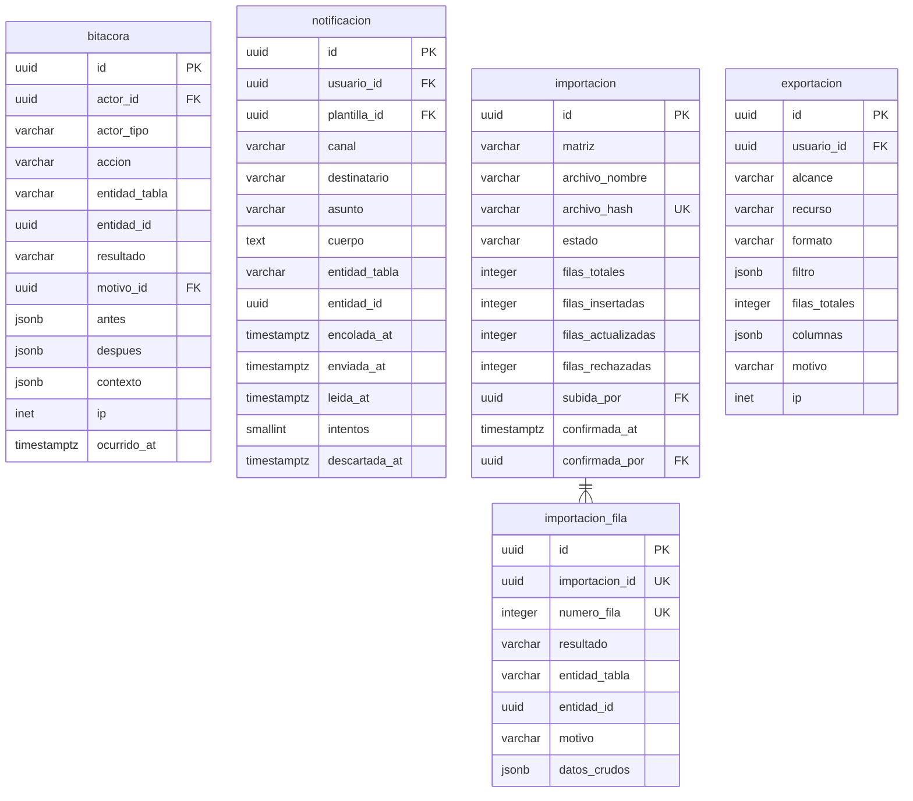

# Auditoría

Cinco tablas. Tres de ellas son las que más crecen del modelo.

---

## La relación que no se declara

`bitacora.entidad_id` y `notificacion.entidad_id` referencian filas de cualquiera
de las 82 tablas mediante `entidad_tabla` más el identificador, y **no llevan
llave foránea**. Es la única relación deliberadamente no declarada del diseño.

Declararla exigiría 82 columnas nulables o una tabla por entidad auditada, y
además impediría registrar operaciones sobre filas que después dejan de existir.
El costo es que la integridad de esa referencia no está garantizada; el beneficio
es que la bitácora puede registrar cualquier cosa sin que el esquema tenga que
saberlo de antemano.

---

## Índices BRIN

|               Índice                |         Tabla          |
| :---------------------------------: | :--------------------: |
|      `brin_bitacora_ocurrido`       |       `bitacora`       |
|    `brin_notificacion_encolada`     |     `notificacion`     |
|    `brin_intentoacceso_created`     |    `intento_acceso`    |
| `brin_participacionevento_ocurrido` | `participacion_evento` |

Las cuatro tablas se escriben en orden cronológico y se consultan por rangos de
fecha, que es el caso exacto para el que BRIN existe. Un B-tree sobre la misma
columna ocuparía dos órdenes de magnitud más para responder lo mismo.

---

## Notas del nivel físico

**`bitacora.antes` y `despues` guardan solo las columnas que cambiaron**, no la
fila entera. Una fila entera por evento enterraría el dato relevante entre treinta
columnas idénticas.

**`bitacora.resultado` incluye `rechazado`.** Registrar solo lo que salió bien
deja fuera la información más útil de una auditoría: quién intentó qué y por qué
el sistema no se lo permitió.

**`notificacion.asunto` y `cuerpo` se congelan al encolar.** Una plantilla editada
entre el encolado y el envío produciría dos mensajes distintos para el mismo
hecho.

**`importacion_fila.datos_crudos` es la única tabla del modelo que guarda datos
sin normalizar**, y lo hace porque su función es documentar una migración. Es lo
que rescata las certificaciones de mentor apiladas en una celda.

**`exportacion` no guarda a quién se exportó**, solo quién exportó y con qué
filtro. Guardar la lista duplicaría los datos personales que el registro pretende
vigilar.
