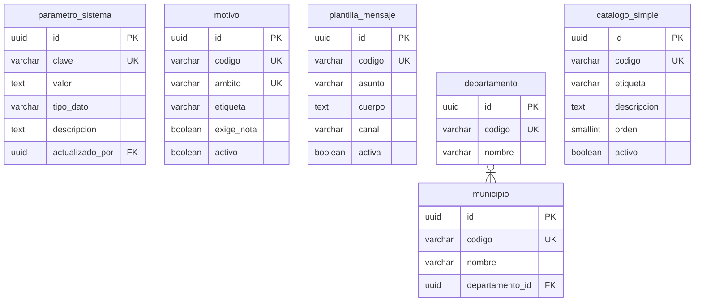

# Catálogos

Quince tablas: tres de configuración y doce catálogos operativos que comparten la
misma forma.

---

## Las doce tablas con forma `catalogo_simple`

`catalogo_simple` no existe: es la plantilla que comparten doce tablas reales.
Todas tienen exactamente esas cinco columnas más las estándar, y todas llevan
`unq_<tabla>_codigo`, `trg_<tabla>_codigo_readonly` y `trg_<tabla>_no_borrar`.

|         Tabla         | Filas |             Referenciada desde              |
| :-------------------: | :---: | :-----------------------------------------: |
|        `sexo`         |   3   |                  `usuario`                  |
|        `etnia`        |  13   |                  `usuario`                  |
|   `talla_camiseta`    |   7   |                  `usuario`                  |
|   `nivel_academico`   |   6   |      `perfil_docente`, `perfil_mentor`      |
|    `anio_carrera`     |   8   |            `estudiante_carrera`             |
|  `rol_participacion`  |  11   |     `participacion`, `regla_puntuacion`     |
|   `tipo_actividad`    |   7   | `actividad`, `programa`, `regla_puntuacion` |
|     `tipo_mentor`     |   4   |               `perfil_mentor`               |
| `tipo_reconocimiento` |   6   |    `reconocimiento`, `regla_puntuacion`     |
|  `area_experiencia`   | 20-30 |          `mentor_area_experiencia`          |
|    `departamento`     |  17   |                 `municipio`                 |
|      `municipio`      |  153  |               `perfil_mentor`               |

`municipio` es la única que se aparta: agrega `departamento_id`.

---

## Notas del nivel físico

`parametro_sistema.valor` es `text` y no un tipo por parámetro. La alternativa
—una columna por tipo, o una tabla por familia— multiplicaría la estructura para
doce filas. `tipo_dato` declara cómo interpretarlo y la aplicación valida al
leer.

`motivo` tiene unicidad compuesta sobre `(codigo, ambito)` y no sobre `codigo`
solo. El mismo código `duplicado` puede existir en el ámbito de fusión de
usuarios y en el de rechazo de inscripción con textos distintos, y la llave
compuesta es lo que impide que un motivo de un ámbito se use en otro.

Ninguna tabla de este módulo admite `DELETE`. Un valor de catálogo referenciado
por una sola fila histórica es parte del historial: se desactiva con `activo`, no
se borra.
