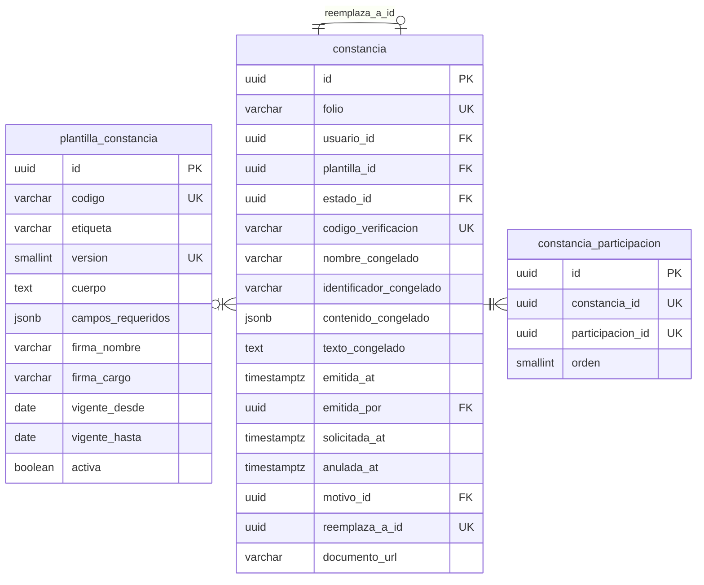

# Constancias

Tres tablas, y una columna `jsonb` que hace todo el trabajo.

---

## El congelado

Cuatro columnas duplican datos que existen en otras tablas, y esa duplicación es
el punto del módulo.

|          Columna          |                  Qué conserva                  |
| :-----------------------: | :--------------------------------------------: |
|    `nombre_congelado`     |         El nombre tal como se imprimió         |
| `identificador_congelado` |    El CIF o la cédula tal como se imprimió     |
|   `contenido_congelado`   | Actividades, fechas, roles y horas, en `jsonb` |
|     `texto_congelado`     | El cuerpo ya sustituido, listo para reimprimir |

Una constancia impresa en 2024 dice el nombre que la persona tenía entonces.
Reconstruirla por unión con los datos actuales produciría, tres años después, un
documento distinto del que la persona tiene en la mano.

El caso decisivo es la anulación de una participación amparada: la constancia
queda anulada, pero la verificación pública tiene que seguir mostrando qué decía
ese folio para poder afirmar que dejó de tener validez.

---

## Notas del nivel físico

**`folio` lo genera un trigger desde una secuencia**, y el valor recibido se
ignora. La secuencia se consume aunque la transacción falle, y eso es correcto:
un hueco en la numeración es inocuo, un folio repetido no lo es.

**`codigo_verificacion` es independiente del folio.** El folio es correlativo y
adivinable; exigir ambos impide recorrer los folios de un año y listar las
constancias emitidas.

**`constancia_participacion` es de muchos a muchos** porque el consolidado que la
persona pide al graduarse ampara varias participaciones, y una misma participación
puede constar en la constancia individual y en ese consolidado.

**Es el índice sobre `participacion_id` el que hace operativa la anulación en
cascada.** Anulada una participación, resolver qué folios quedan invalidados es
una búsqueda directa y no un recorrido del `jsonb` de cada constancia.
