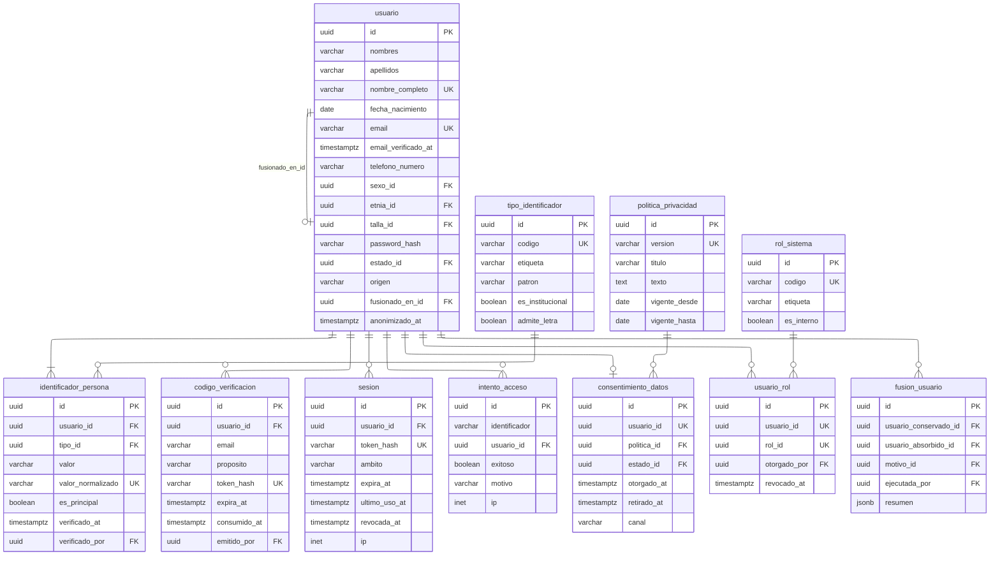

# Identidad

Once tablas. Es el módulo más denso del modelo y el que sostiene la regla que
motivó el proyecto.

---

## Las restricciones que el diagrama no muestra

|             Restricción              |                                         Qué garantiza                                          |
| :----------------------------------: | :--------------------------------------------------------------------------------------------: |
|   `unq_identificadorpersona_valor`   | Sobre `(tipo_id, valor_normalizado)`. Un CIF pertenece a una sola persona: es [`RN-02`][rn-02] |
| `unq_identificadorpersona_principal` |                      Índice parcial `WHERE es_principal`. Uno y solo uno                       |
|         `unq_usuario_email`          |                  Sobre `lower(email)`, parcial `WHERE anonimizado_at IS NULL`                  |
|   `unq_politicaprivacidad_vigente`   |                  `((true)) WHERE vigente_hasta IS NULL`. Una versión vigente                   |
|       `unq_usuariorol_vigente`       |                              Parcial `WHERE revocado_at IS NULL`                               |

---

## Notas del nivel físico

**`valor_normalizado` es columna generada y almacenada.** Convierte a mayúsculas
y elimina guiones y espacios, de modo que `001-120500-1000X` y `0011205001000X`
colisionen en el índice único. Sin la normalización, la regla de no duplicados se
esquivaría con un guion.

**`nombre_completo` también es generada**, y sostiene el índice trigram que
permite la detección de duplicados por similitud. Concatenar en la consulta
impediría usar índice.

**`fusionado_en_id` es autorreferencia con `RESTRICT`.** El registro conservado
nunca puede desaparecer mientras alguien lo apunte, que es lo que mantiene
resolubles los enlaces antiguos.

**`intento_acceso.identificador` guarda lo tecleado y no solo el `usuario_id`
resuelto.** El caso que interesa vigilar es precisamente aquel en que no
resuelve: alguien probando identificadores contra el panel.

**`fusion_usuario` tiene dos llaves foráneas a `usuario`** y ambas con
`RESTRICT`. El par es ordenado: invertirlo cambiaría quién absorbió a quién.

[rn-02]: ../../../requerimientos/reglas-negocio.md#rn-02
