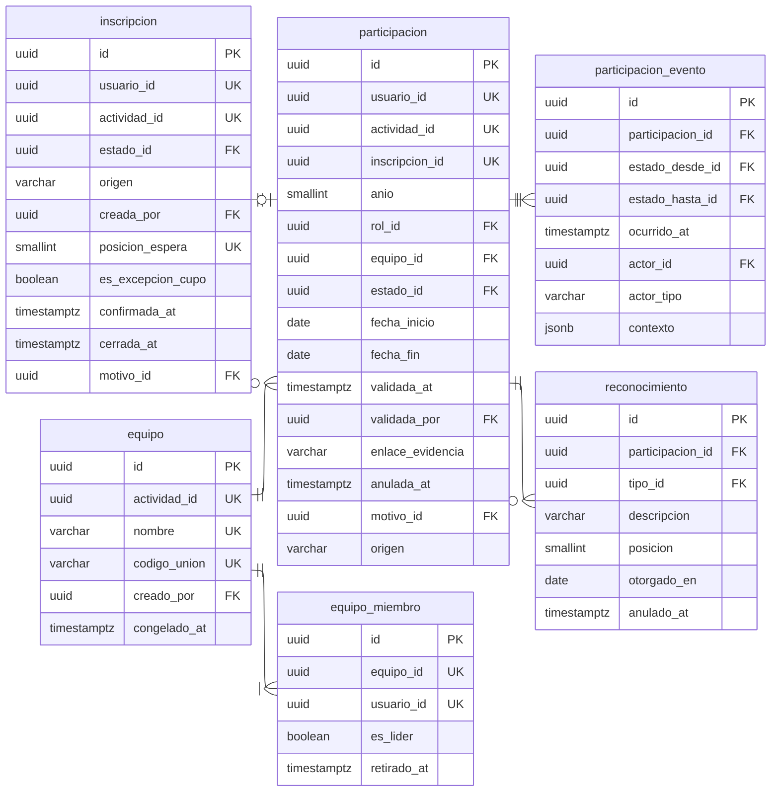

# Participación

Seis tablas. Las dos primeras son la razón de ser del sistema.

---

## Los índices únicos parciales

|               Índice               |                                 Definición                                 |               Qué impide                |
| :--------------------------------: | :------------------------------------------------------------------------: | :-------------------------------------: |
|  `unq_inscripcion_persona_activa`  |           `(usuario_id, actividad_id) WHERE cerrada_at IS NULL`            |   Dos inscripciones vivas a lo mismo    |
| `unq_participacion_persona_activa` |           `(usuario_id, actividad_id) WHERE anulada_at IS NULL`            |     Contar dos veces a una persona      |
|  `unq_participacion_inscripcion`   | `(inscripcion_id) WHERE inscripcion_id IS NOT NULL AND anulada_at IS NULL` | Una inscripción con dos participaciones |
| `unq_inscripcion_posicion_espera`  |    `(actividad_id, posicion_espera) WHERE posicion_espera IS NOT NULL`     |      Empates en la lista de espera      |
|     `unq_equipomiembro_lider`      |            `(equipo_id) WHERE es_lider AND retirado_at IS NULL`            |            Dos líderes vivos            |

El primero es el que hace cumplir la regla bajo concurrencia. Una comprobación
previa en la aplicación dejaría pasar dos peticiones simultáneas del mismo
estudiante pulsando dos veces el botón, que es como se produce la mayoría de los
duplicados reales.

---

## Notas del nivel físico

**`participacion.inscripcion_id` es nulable**, y esa nulabilidad es la que hace
honesta la tabla. En una charla abierta la asistencia se recoge el mismo día;
forzar una inscripción sintética crearía inscripciones que nadie hizo.

**`participacion.anio` se copia de la actividad al crear la fila.** Es
denormalización deliberada: el índice de conteo anual sostiene el reporte más
pedido del sistema.

**Ninguna de las dos admite `DELETE`.** Un trigger `BEFORE DELETE` lo bloquea. La
corrección se hace por cierre o anulación con motivo, conservando el original.

**`equipo_miembro` no valida el tamaño mínimo por trigger.** Un equipo se
construye de uno en uno y el primer miembro siempre violaría el mínimo; se valida
al cerrar la inscripción, donde alguien decide si el equipo incompleto se disuelve
o se admite.
