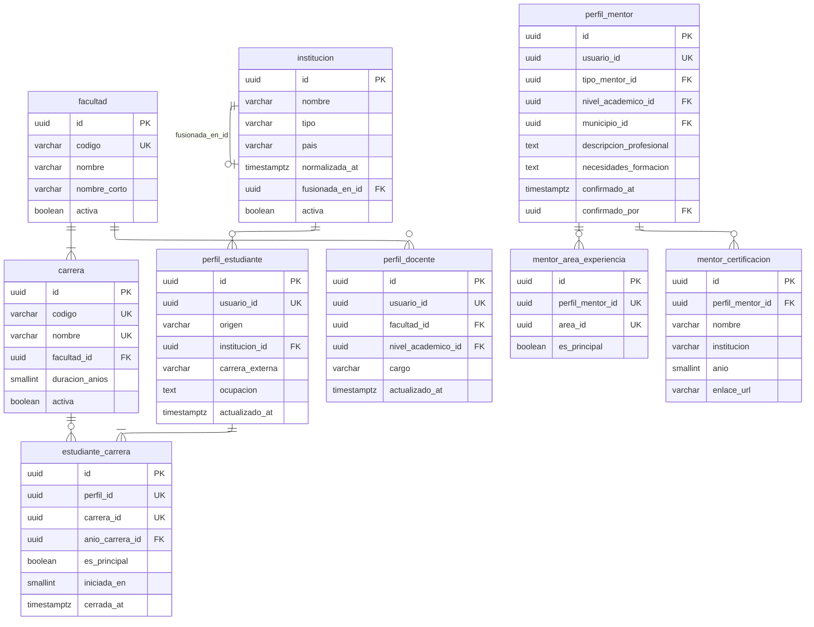

# Perfiles

Diez tablas: tres de estructura académica y siete de perfil.

---

## Índices únicos que sostienen invariantes

|              Índice               |                       Definición                        |              Invariante               |
| :-------------------------------: | :-----------------------------------------------------: | :-----------------------------------: |
| `unq_estudiantecarrera_principal` | `(perfil_id) WHERE es_principal AND cerrada_at IS NULL` |   Exactamente una carrera principal   |
|    `unq_mentorarea_principal`     |         `(perfil_mentor_id) WHERE es_principal`         |  Como máximo un área de especialidad  |
|   `unq_carrera_nombre_facultad`   |             `(facultad_id, lower(nombre))`              | Sin carreras repetidas en la facultad |

---

## Notas del nivel físico

**Los cuatro perfiles llevan `usuario_id` con unicidad**, no llave primaria
compartida. La diferencia es práctica: un `id` propio permite que
`mentor_certificacion` apunte al perfil y no al usuario, de modo que retirar el
perfil de mentor se lleve sus certificaciones sin tocar nada más.

**`estudiante_carrera` es la única relación de muchos a muchos del módulo**, y
existe por la doble titulación. Sin ella, `carrera_id` sería una columna de
`perfil_estudiante` y la pregunta _¿en qué carrera cuento a esta persona?_ tendría
una respuesta única y equivocada.

**`institucion` es el único catálogo con autorreferencia.** Es también el único
que admite altas desde un formulario de registro, y por eso necesita el mecanismo
de normalización: tres personas escribiendo el nombre de la misma universidad de
tres maneras producen tres filas, y `fusionada_en_id` las unifica después sin
perder lo que cada una declaró.

**`perfil_mentor.confirmado_at` no es un estado.** Es la marca que separa el
aspirante del mentor: el perfil existe desde que la persona lo solicita, con sus
áreas y certificaciones ya cargadas, pero no aparece como mentor disponible hasta
que la DIEM lo confirma.
