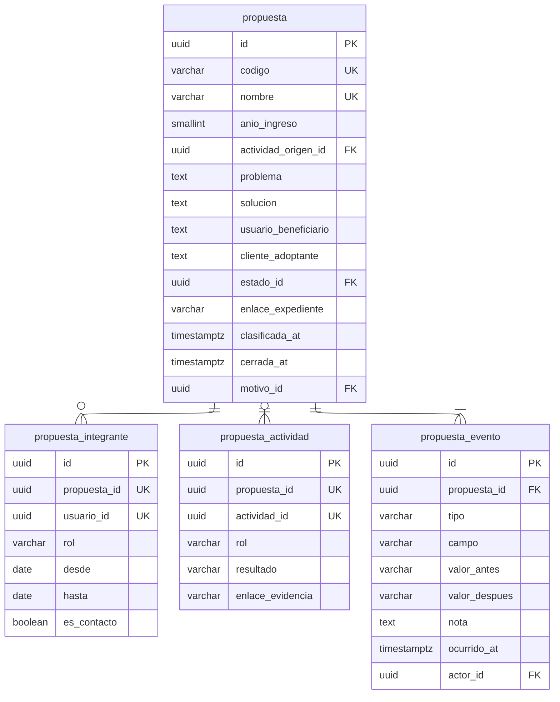

# Portafolio

Cuatro tablas. `propuesta` lleva diez llaves foráneas de clasificación, dibujadas
en [`Taxonomías`][tax].

---

## Índices únicos parciales

|                Índice                 |                          Definición                          |       Qué garantiza       |
| :-----------------------------------: | :----------------------------------------------------------: | :-----------------------: |
| `unq_propuestaintegrante_responsable` | `(propuesta_id) WHERE rol = 'responsable' AND hasta IS NULL` |    Un responsable vivo    |
|  `unq_propuestaintegrante_contacto`   |     `(propuesta_id) WHERE es_contacto AND hasta IS NULL`     |     Un contacto vivo      |
|   `unq_propuestaintegrante_vigente`   |       `(propuesta_id, usuario_id) WHERE hasta IS NULL`       | Sin integrantes repetidos |

---

## Notas del nivel físico

**`codigo` lo genera un trigger y es inmutable**, con la forma
`UAM-INN-<año>-<correlativo>`. `anio_ingreso` también es inmutable, porque el
glosario de la matriz lo dice: es el año del primer ingreso y no cambia aunque la
propuesta siga participando después. Sin el trigger, la corrección más razonable
del mundo rompería el correlativo.

**`clasificada_at` no es un estado**: es la marca que dice si alguna de las diez
clasificaciones sigue en un valor neutro. Es lo que permite medir cuántas
propuestas están realmente clasificadas, que es el indicador que
[`R-07`][r-07] pide vigilar.

**`propuesta_actividad` duplica `actividad_origen_id`** con rol `origina`. La
columna sostiene la consulta directa; la fila sostiene el recorrido cronológico
completo. Un trigger mantiene ambas coherentes.

**`propuesta_evento` no tiene llaves foráneas a las taxonomías.** Guarda las
etiquetas legibles, no los UUID: la trayectoria se lee años después y debe decir
_pasó de preincubación a incubación_. Además, un evento histórico no debe impedir
desactivar una clasificación que la DIEM ya no usa.

**El módulo no referencia a `participacion` en ningún punto.** Una propuesta se
vincula a personas y a actividades, nunca a participaciones concretas.

[r-07]: ../../../modelo-dominio/riesgos.md#r-07
[tax]: taxonomias.md
