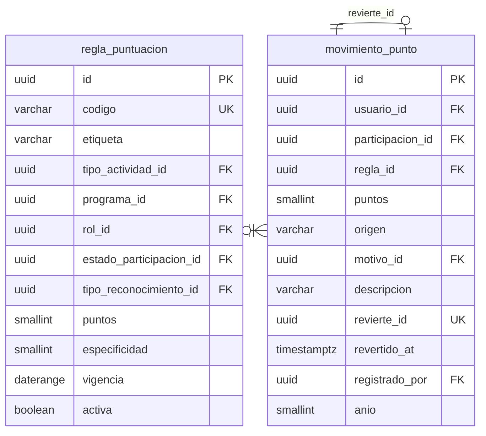

# Puntos

Dos tablas. Ninguna columna del modelo se llama `saldo`.



---

## La restricción de exclusión

```postgresql
CONSTRAINT exc_reglapuntuacion_vigencia
EXCLUDE USING gist (
  coalesce(tipo_actividad_id, '00000000-0000-0000-0000-000000000000'::uuid) WITH =,
  coalesce(programa_id,       '00000000-0000-0000-0000-000000000000'::uuid) WITH =,
  coalesce(rol_id,            '00000000-0000-0000-0000-000000000000'::uuid) WITH =,
  coalesce(estado_participacion_id, '00000000-0000-0000-0000-000000000000'::uuid) WITH =,
  coalesce(tipo_reconocimiento_id,  '00000000-0000-0000-0000-000000000000'::uuid) WITH =,
  vigencia WITH &&
) WHERE (activa)
```

Es lo que convierte _no debería haber dos reglas solapadas_ en algo que la base
de datos impide. Comprobarlo desde la interfaz falla exactamente cuando dos
administradores editan el baremo el mismo día, que es cuando el solape se
produce.

El `coalesce` existe porque `NULL` no es igual a `NULL` bajo `WITH =`: sin él,
dos reglas genéricas idénticas y vigentes a la vez no colisionarían.

---

## Notas del nivel físico

**`vigencia` es `daterange` y no dos columnas de fecha.** Los operadores de
solape trabajan sobre rangos y la restricción de exclusión los exige.

**`especificidad` es generada y almacenada.** Cuenta los criterios no nulos y
resuelve el orden cuando varias reglas coinciden: gana la más específica. Sin la
columna, el `ORDER BY` tendría que contar nulos en cinco columnas.

**`movimiento_punto.puntos` es `smallint` con signo y nunca cero.** Un asiento de
cero puntos no dice nada y ensuciaría el detalle que la persona lee.

**`revierte_id` es autorreferencia con unicidad parcial.** Un asiento se revierte
una sola vez; el reverso de un reverso sería una forma elaborada de perder el
rastro.

**La tabla solo admite un `UPDATE`: fijar `revertido_at`.** Cualquier otro cambio
lo rechaza un trigger, y `DELETE` está bloqueado. Es un libro mayor.
