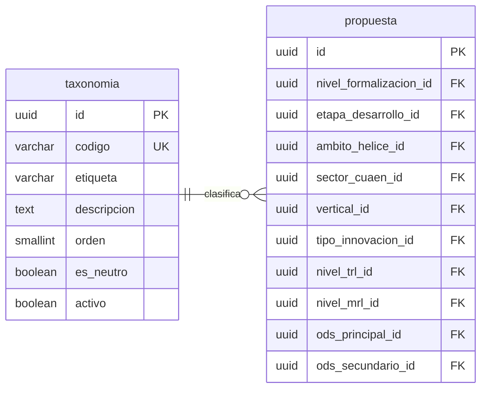

# Taxonomías

Nueve marcos de clasificación externos al sistema. Todos con la misma forma y
todos referenciados por una sola tabla.

---

## Las nueve tablas

`taxonomia` es la plantilla. Las tablas reales son:

|         Tabla         | Filas |                         Marco de referencia                          |
| :-------------------: | :---: | :------------------------------------------------------------------: |
| `nivel_formalizacion` |   3   |                      Idea, iniciativa, proyecto                      |
|  `etapa_desarrollo`   |   5   | Estructuración, preincubación, incubación, aceleración, escalamiento |
|    `ambito_helice`    |   5   |                           Quíntuple hélice                           |
|    `sector_cuaen`     |  24   |       Secciones A-U del clasificador nacional, más dos neutros       |
| `vertical_innovacion` |  23   |                  Verticales tecnológicas del sector                  |
|   `tipo_innovacion`   |  11   |               Los diez tipos de Doblin, más un neutro                |
|      `nivel_trl`      |  11   |                               TRL 1-9                                |
|      `nivel_mrl`      |  11   |                               MRL 1-9                                |
|         `ods`         |  20   |              Los 17 Objetivos, más tres valores neutros              |

---

## Notas del nivel físico

**Diez llaves foráneas salen de `propuesta` hacia nueve tablas.** `ods` recibe
dos, porque el modelo admite un ODS principal y uno secundario y el orden entre
ellos es significativo. Una tabla puente con columna de orden modelaría lo mismo
admitiendo un tercero que el marco no contempla.

**Ninguna de las diez columnas es nulable.** Donde falta el dato, la taxonomía
aporta un valor con `es_neutro` en verdadero. Es la columna que distingue _por
determinar_ de una clasificación real y la que permite medir cuántas propuestas
están efectivamente clasificadas.

**`nivel_trl` y `nivel_mrl` son tablas separadas** aunque tengan la misma forma y
el mismo número de filas. Fundirlas en una escala genérica con discriminador
permitiría asignar un valor de madurez de mercado a la columna de madurez
tecnológica, que es exactamente el error que la separación previene.

**Todas son de solo lectura en la práctica.** Los nueve marcos los definen
organismos externos —Naciones Unidas, el clasificador nacional, la literatura de
innovación—, de modo que `activo` sirve para dejar de ofrecer un valor, nunca
para corregirlo.
