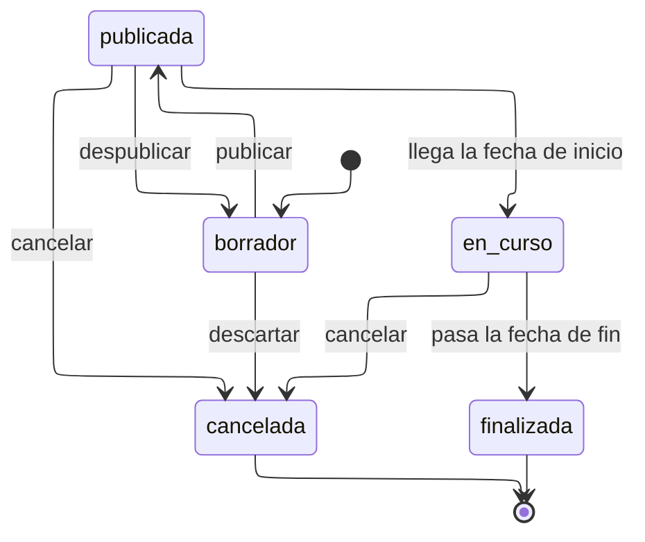

# Estados de actividad

---

## Atributos semánticos

|    Estado    | `visible_publico` | `admite_inscripcion` | `admite_validacion` |
| :----------: | :---------------: | :------------------: | :-----------------: |
|  `borrador`  |        No         |          No          |         No          |
| `publicada`  |        Sí         |          Sí          |         No          |
|  `en_curso`  |        Sí         |          Sí          |         Sí          |
| `finalizada` |        Sí         |          No          |         Sí          |
| `cancelada`  |        Sí         |          No          |         No          |

`admite_inscripcion` es verdadero en `en_curso` porque hay actividades de varias
semanas que siguen admitiendo altas después de empezar. Que la ventana esté
abierta lo deciden además `inscripcion_abre_at` y `cierra_at`: el estado permite,
las fechas concretan.

---

## Transiciones

|         Transición         |     Actor      | Motivo |                        Efecto                        |
| :------------------------: | :------------: | :----: | :--------------------------------------------------: |
| `borrador` => `publicada`  | Administración |   No   | Exige nombre, tipo, fecha de inicio y un responsable |
| `publicada` => `borrador`  | Administración |   Sí   |          Solo si no hay inscripciones vivas          |
| `publicada` => `en_curso`  |    Sistema     |   No   |               Proceso diario por fecha               |
| `en_curso` => `finalizada` |    Sistema     |   No   |               Proceso diario por fecha               |
| Cualquiera => `cancelada`  | Administración |   Sí   |  Cierra las inscripciones vivas con el mismo motivo  |

---

## Notas

**`publicada` => `borrador` existe y está restringida.** Despublicar una actividad
con gente ya inscrita dejaría a esas personas apuntadas a algo que no existe
públicamente. El modelo lo permite solo mientras nadie se haya inscrito, que es
cuando corregir un error de publicación es inocuo.

**Las dos transiciones por fecha las ejecuta el sistema**, y constan en la
bitácora con `actor_tipo = 'sistema'`. Es lo que permite responder si una
actividad se cerró sola o alguien la cerró.

**`cancelada` es terminal y arrastra.** Al cancelar, un trigger cierra todas las
inscripciones vivas con el motivo de la actividad, de modo que nadie quede
apuntado a algo que no ocurrirá. Las participaciones ya validadas **no** se
tocan: si la actividad se canceló a mitad, lo que ocurrió ocurrió.

**No hay estado `inscripciones_abiertas`.** Sería una consecuencia de las fechas
de la ventana, no algo que alguien decida, y tenerlo permitiría la contradicción
de estar publicada con inscripciones cerradas y en estado de inscripciones
abiertas.
