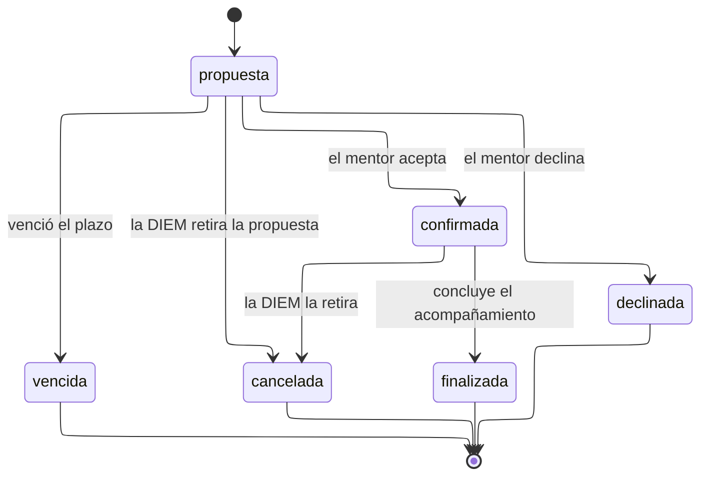

# Estados de asignación de mentoría

---

## Atributos semánticos

|    Estado    | `es_acompanamiento_vigente` | `visible_publico` |
| :----------: | :-------------------------: | :---------------: |
| `propuesta`  |             No              |        No         |
| `confirmada` |             Sí              |        Sí         |
| `finalizada` |             No              |        Sí         |
| `declinada`  |             No              |        No         |
|  `vencida`   |             No              |        No         |
| `cancelada`  |             No              |        No         |

`visible_publico` distingue lo que la Universidad puede afirmar de lo que no.
Solo aparecen en la ficha de la actividad los mentores que aceptaron: publicar
como mentor confirmado a alguien que nunca respondió es una afirmación
institucional falsa sobre una persona.

---

## Transiciones

|          Transición          |     Actor      | Motivo |                Nota                 |
| :--------------------------: | :------------: | :----: | :---------------------------------: |
| `propuesta` => `confirmada`  |     Mentor     |   No   |        Fija `respondida_at`         |
|  `propuesta` => `declinada`  |     Mentor     |   Sí   |        Fija `respondida_at`         |
|   `propuesta` => `vencida`   |    Sistema     |   No   |    Proceso diario tras el plazo     |
| `confirmada` => `finalizada` |     Ambos      |   No   | El mentor puede registrar su aporte |
|  Cualquiera => `cancelada`   | Administración |   Sí   |                                     |

---

## Notas

**El silencio no confirma.** Una propuesta sin respuesta pasa a `vencida`, nunca a
`confirmada`. Es la diferencia entre registrar un acuerdo y suponerlo.

**`declinada` y `vencida` son estados distintos** aunque ambos terminen sin
acompañamiento. Uno dice que el mentor respondió que no; el otro, que no
respondió. La DIEM necesita saber a cuál de los dos se enfrenta antes de volver a
proponerle.

**Solo se puede proponer a un perfil de mentor confirmado por la DIEM.** El
perfil existe desde que la persona lo solicita, pero
`trg_asignacionmentor_mentor_confirmado` rechaza asignar a quien todavía no ha
sido confirmado. Son dos verificaciones distintas: la DIEM confirma que la persona
es mentor, y el mentor confirma que acompaña esta actividad.

**No hay `transicion_asignacion_mentor`.** El ciclo es lineal y con un solo punto
de decisión, demasiado simple para justificar una tabla de pares; las reglas
viven en `trg_asignacionmentor_estado_coherente`.
