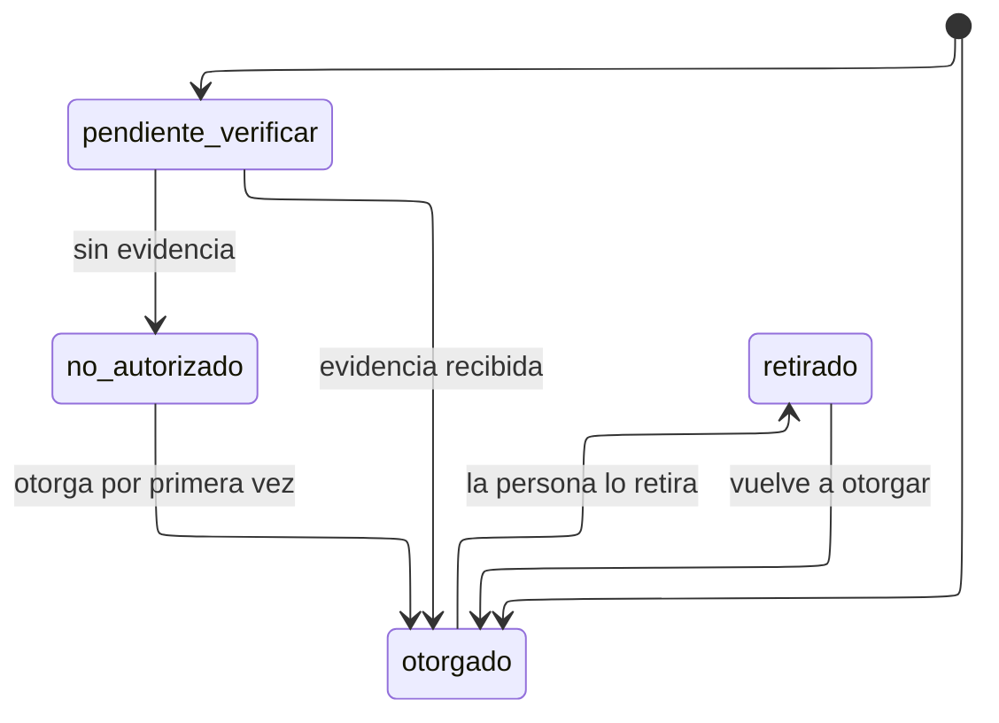

# Estados del consentimiento

---

## Atributos semánticos

|        Estado         | `habilita_reporte_nominal` | `habilita_comunicacion` |
| :-------------------: | :------------------------: | :---------------------: |
|      `otorgado`       |             Sí             |           Sí            |
| `pendiente_verificar` |             No             |           No            |
|    `no_autorizado`    |             No             |           No            |
|      `retirado`       |             No             |           No            |

Tres de los cuatro estados bloquean lo mismo, y aun así son tres y no uno.
Fundirlos perdería la distinción entre _nunca autorizó_, _dijo que no_ y
_autorizó y se arrepintió_, que es exactamente la información que una consulta de
regularización necesita.

---

## Los dos estados iniciales

El diagrama tiene dos entradas y es correcto:

|         Origen          |    Estado inicial     |                     Por qué                      |
| :---------------------: | :-------------------: | :----------------------------------------------: |
|  Registro en el portal  |      `otorgado`       |    La persona acepta el aviso al registrarse     |
| Importación de matrices | `pendiente_verificar` | La DIEM cree que autorizaron; no tiene evidencia |

La matriz de estudiantes ya tiene tres valores en su campo de autorización y
advierte que no sustituye al aviso de privacidad. Estos estados son esa
advertencia convertida en modelo.

---

## Notas

**`retirado` no borra nada.** La persona sigue en el sistema y sus
participaciones siguen contando; lo que se apaga es su aparición en reportes
nominales y la comunicación por correo.

**El ciclo admite volver a `otorgado` desde cualquier estado de bloqueo**, y esa
reversibilidad es el punto: el consentimiento no es una decisión de una sola vez.
Al reotorgar se registra la versión de política vigente en ese momento, que puede
no ser la de la primera vez.

**Ninguna transición la ejecuta el sistema por sí solo.** El paso a
`no_autorizado` desde `pendiente_verificar` lo hace la administración tras
concluir la revisión, no un plazo vencido. Deducir una negativa del silencio sería
la lectura equivocada.
