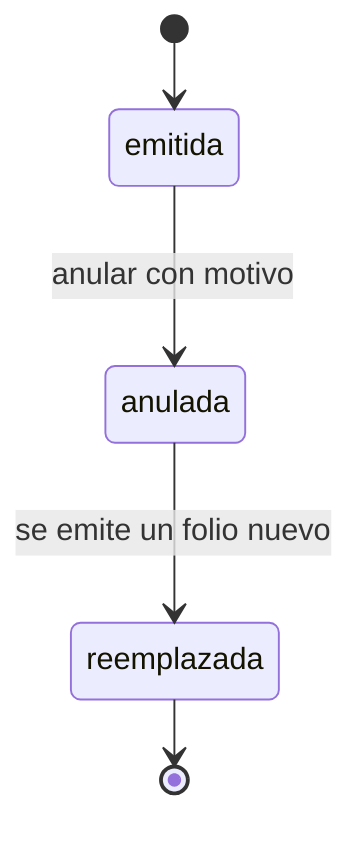

# Estados de constancia

Tres estados. El ciclo más corto del modelo y el que menos admite marcha atrás.

---

## Atributos semánticos

|    Estado     | `es_valida` | `es_cierre` |
| :-----------: | :---------: | :---------: |
|   `emitida`   |     Sí      |     No      |
|   `anulada`   |     No      |     Sí      |
| `reemplazada` |     No      |     Sí      |

`es_valida` es lo que responde la página pública de verificación. Un folio
anulado se informa como anulado, no como inexistente: negar que existió sería
otra afirmación falsa.

---

## Transiciones

|         Transición         |     Actor      | Motivo |                        Efecto                        |
| :------------------------: | :------------: | :----: | :--------------------------------------------------: |
|   `emitida` => `anulada`   | Administración |   Sí   | También la produce anular una participación amparada |
| `anulada` => `reemplazada` | Administración |   No   |     La marca el alta de la constancia sustituta      |

---

## Notas

**No hay vuelta desde `anulada` a `emitida`.** Un folio anulado no se reactiva:
se emite otro. Reactivarlo dejaría a la verificación pública afirmando primero
que el folio dejó de tener validez y después que la tiene, sobre el mismo
documento que alguien puede tener impreso.

**`reemplazada` no la fija quien anula**, sino la emisión de la constancia nueva.
Es una consecuencia, no una decisión: existe para que la verificación de un folio
antiguo pueda señalar cuál lo sustituyó.

**La anulación llega por dos caminos.** Uno es directo, con motivo. El otro es
indirecto: anular una participación invalida automáticamente las constancias que
la amparan, mediante `trg_participacion_revertir_puntos`. En ambos casos consta el
motivo.

**El contenido no cambia al anular.** El nombre, las actividades y el texto siguen
congelados tal como se imprimieron, porque la verificación tiene que mostrar qué
decía ese folio para poder afirmar que dejó de valer.
