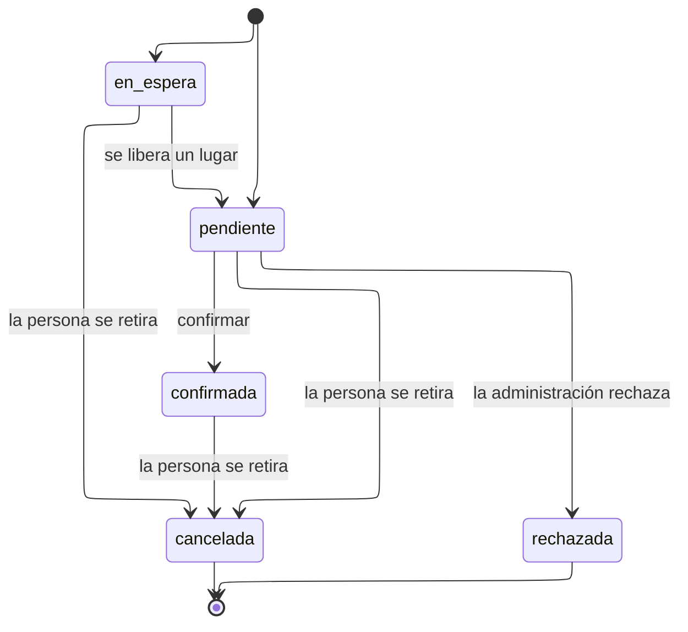

# Estados de inscripción

Cinco estados. La mitad del par que motiva el sistema: esto es intención, no
hecho.

---

## Atributos semánticos

|    Estado    | `ocupa_cupo` | `es_cierre` | `admite_participacion` |
| :----------: | :----------: | :---------: | :--------------------: |
| `pendiente`  |      Sí      |     No      |           Sí           |
| `confirmada` |      Sí      |     No      |           Sí           |
| `en_espera`  |      No      |     No      |           No           |
| `cancelada`  |      No      |     Sí      |           No           |
| `rechazada`  |      No      |     Sí      |           No           |

**`ocupa_cupo` es el atributo que sostiene el contador.**
`actividad.inscritos_activos` suma solo los estados que lo declaran, de modo que
cancelar libera cupo sin lógica adicional y añadir un estado nuevo es marcar un
booleano.

---

## Transiciones

|         Transición          |             Actor             | Motivo |                     Nota                      |
| :-------------------------: | :---------------------------: | :----: | :-------------------------------------------: |
| `pendiente` => `confirmada` |    Participante o sistema     |   No   |                                               |
| `en_espera` => `pendiente`  |            Sistema            |   No   | Promoción por lugar liberado; no autoconfirma |
|  Cualquiera => `cancelada`  | Participante o administración |   Sí   |  Bloqueada si ya hay participación validada   |
| `pendiente` => `rechazada`  |        Administración         |   Sí   |            Requisitos no cumplidos            |

---

## Notas

**Hay dos estados iniciales.** Si la actividad tiene cupo libre, la inscripción
nace `pendiente`; si está llena y admite lista de espera, nace `en_espera`. El
estado inicial lo decide el cupo, no la persona.

**La promoción desde la lista de espera lleva a `pendiente`, no a `confirmada`.**
Ascender directamente a confirmada llenaría los cupos con personas que ya no
pueden asistir, que es el modo en que las listas de espera dejan de servir. Quien
asciende recibe una notificación y dispone de un plazo.

**`cancelada` está bloqueada si existe participación validada.** Sin ese bloqueo,
un estudiante podría borrar de su historial la actividad de la que se retiró a
mitad, que es exactamente el dato que la DIEM necesita conservar. Lo impide
`trg_inscripcion_cierre_bloqueado`.

**No existe el estado `no_asistio`.** La no asistencia es un desenlace de
participación y no de inscripción; ponerlo aquí obligaría a validar en dos tablas.
