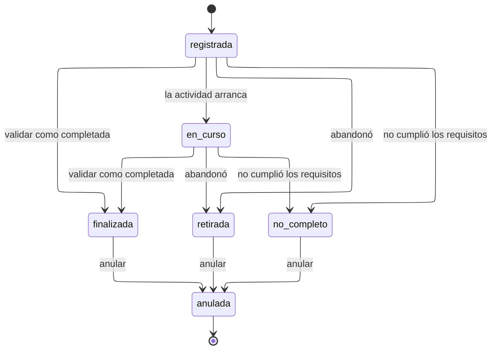

# Estados de participación

Seis estados. Es el ciclo más importante del modelo: de él dependen los puntos,
las constancias y todos los reportes.

---

## Atributos semánticos

|    Estado     | `es_efectiva` | `otorga_puntos` | `habilita_constancia` | `es_cierre` |
| :-----------: | :-----------: | :-------------: | :-------------------: | :---------: |
| `registrada`  |      No       |       No        |          No           |     No      |
|  `en_curso`   |      Sí       |       No        |          No           |     No      |
| `finalizada`  |      Sí       |       Sí        |          Sí           |     Sí      |
|  `retirada`   |      Sí       |       No        |          No           |     Sí      |
| `no_completo` |      Sí       |       Sí        |          No           |     Sí      |
|   `anulada`   |      No       |       No        |          No           |     Sí      |

**`es_efectiva` es el atributo que define quién cuenta como participante.** El
conteo de personas distintas filtra por este booleano y no por una lista de
códigos escrita en cada consulta. Cuando la DIEM decida distinguir _finalizada con
excelencia_ de _finalizada_, será una fila más con los mismos atributos.

`no_completo` otorga puntos porque el baremo admite reglas con puntaje negativo:
la matriz de participaciones contempla ese desenlace y la DIEM puede decidir que
descuente.

---

## Validación y estado son cosas distintas

Todo estado con `es_efectiva` exige que `validada_at` tenga valor. Lo comprueba
`trg_participacion_estado_coherente`, y es lo que impide una participación que
cuenta en los reportes sin que nadie haya afirmado que ocurrió.

|        Situación         | `estado_id`  | `validada_at` |
| :----------------------: | :----------: | :-----------: |
| Registrada y sin validar | `registrada` |     Nulo      |
| Validada como completada | `finalizada` |   Con valor   |
|         Anulada          |  `anulada`   |   Con valor   |

Por eso **no existe el estado `pendiente_validacion`**: sería la ausencia de
`validada_at`, y tenerlo permitiría la contradicción de estar pendiente y validada
a la vez.

---

## Transiciones

|         Transición          |     Actor      | Motivo |                         Efecto                         |
| :-------------------------: | :------------: | :----: | :----------------------------------------------------: |
| `registrada` => `en_curso`  |    Sistema     |   No   |                                                        |
| Cualquiera => `finalizada`  | Administración |   No   | Emite el movimiento de puntos en la misma transacción  |
|  Cualquiera => `retirada`   | Administración |   Sí   |                                                        |
| Cualquiera => `no_completo` | Administración |   Sí   |                                                        |
|   Cualquiera => `anulada`   | Administración |   Sí   | Emite el movimiento inverso e invalida las constancias |

---

## Notas

**La validación es el único momento en que se otorgan puntos**, y ocurre dentro
de la misma transacción. Separarlas permitiría que existiera, aunque fuera un
instante, una participación validada sin sus puntos, y ese instante basta para
que un reporte concurrente publique una cifra menor.

**`anulada` no se puede alcanzar desde `registrada`.** Anular es deshacer un hecho
ya afirmado; una participación registrada y no validada se corrige editándola o
cerrando su inscripción. Usar la anulación antes vaciaría de significado el rastro
de anulaciones.

**La anulación arrastra dos consecuencias** y ambas viven en triggers: el
movimiento de puntos inverso —nunca la edición del original— y la invalidación de
las constancias que amparaban esa participación.

**Todo cambio de estado escribe en `participacion_evento`**, incluida la creación.
La pregunta que una auditoría hace no es _¿está validada?_ sino _¿cuándo se validó
y quién lo hizo?_.
