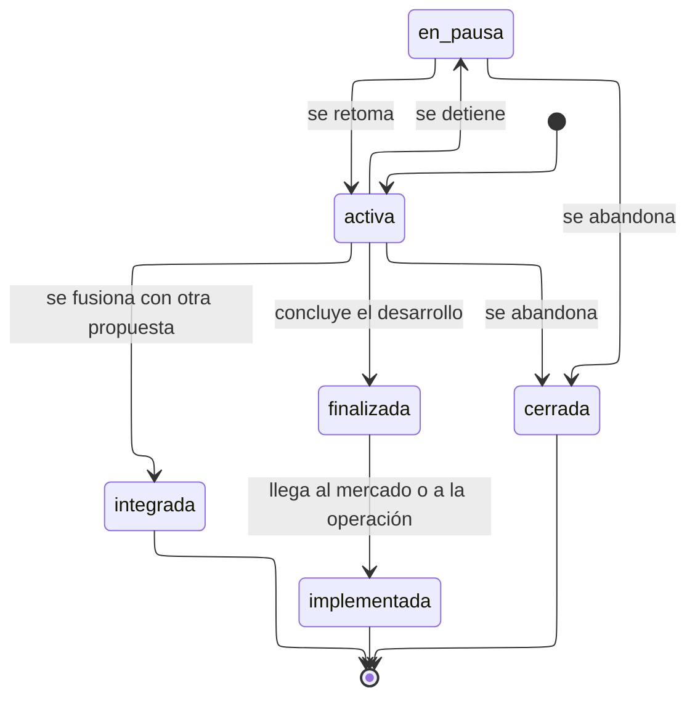

# Estados de propuesta

Seis estados. Es el ciclo más largo del modelo en el tiempo: una propuesta dura
años.

---

## Atributos semánticos

|     Estado     | `es_vigente` | `cuenta_en_portafolio` | `es_cierre` |
| :------------: | :----------: | :--------------------: | :---------: |
|    `activa`    |      Sí      |           Sí           |     No      |
|   `en_pausa`   |      No      |           Sí           |     No      |
|  `finalizada`  |      No      |           Sí           |     No      |
| `implementada` |      No      |           Sí           |     Sí      |
|   `cerrada`    |      No      |           No           |     Sí      |
|  `integrada`   |      No      |           No           |     Sí      |

**`cuenta_en_portafolio` separa el tamaño del portafolio de su actividad.** Cuatro
estados de seis siguen contando: una propuesta implementada es un logro y no debe
desaparecer del recuento por haber terminado bien. Solo salen las abandonadas y
las que se fusionaron con otra, esta última para no contarla dos veces.

---

## Transiciones

|           Transición           |     Actor      | Motivo |                  Nota                   |
| :----------------------------: | :------------: | :----: | :-------------------------------------: |
|     `activa` => `en_pausa`     | Administración |   Sí   |                                         |
|     `en_pausa` => `activa`     | Administración |   No   |                                         |
|    `activa` => `finalizada`    | Administración |   No   |                                         |
| `finalizada` => `implementada` | Administración |   No   |    Exige evidencia en el expediente     |
|    Cualquiera => `cerrada`     | Administración |   Sí   |                                         |
|    `activa` => `integrada`     | Administración |   Sí   | El motivo nombra la propuesta receptora |

---

## Etapa y estado son cosas distintas

|   Dimensión   |                     Qué dice                      |        Dónde vive        |
| :-----------: | :-----------------------------------------------: | :----------------------: |
|  **Estado**   |      Si la propuesta sigue viva y si cuenta       |    `estado_propuesta`    |
|   **Etapa**   | Cuánto ha madurado: estructuración a escalamiento |    `etapa_desarrollo`    |
| **TRL y MRL** |      Madurez tecnológica y de mercado, 1 a 9      | `nivel_trl`, `nivel_mrl` |

Una propuesta puede estar `en_pausa` en etapa de incubación con TRL 5: las tres
dimensiones son independientes y confundirlas produciría una escala de doce
valores que nadie sabría cuándo aplicar.

Los cambios de etapa **no** son transiciones de estado y no aparecen en este
diagrama. Quedan registrados en `propuesta_evento` con tipo `etapa`.

---

## Notas

**`integrada` existe para no contar dos veces.** Dos equipos que trabajan en lo
mismo y deciden unirse dejan una propuesta viva y otra que se integró. Sin este
estado, la segunda tendría que cerrarse como abandonada, que diría algo falso
sobre lo que ocurrió.

**No hay vuelta desde `implementada`.** Una propuesta que llegó al mercado y
después dejó de operar no vuelve a `activa`: eso sería una propuesta nueva, con su
propio código y su propio año de ingreso. El código de una propuesta es inmutable
precisamente para que esa distinción no se pueda difuminar.
