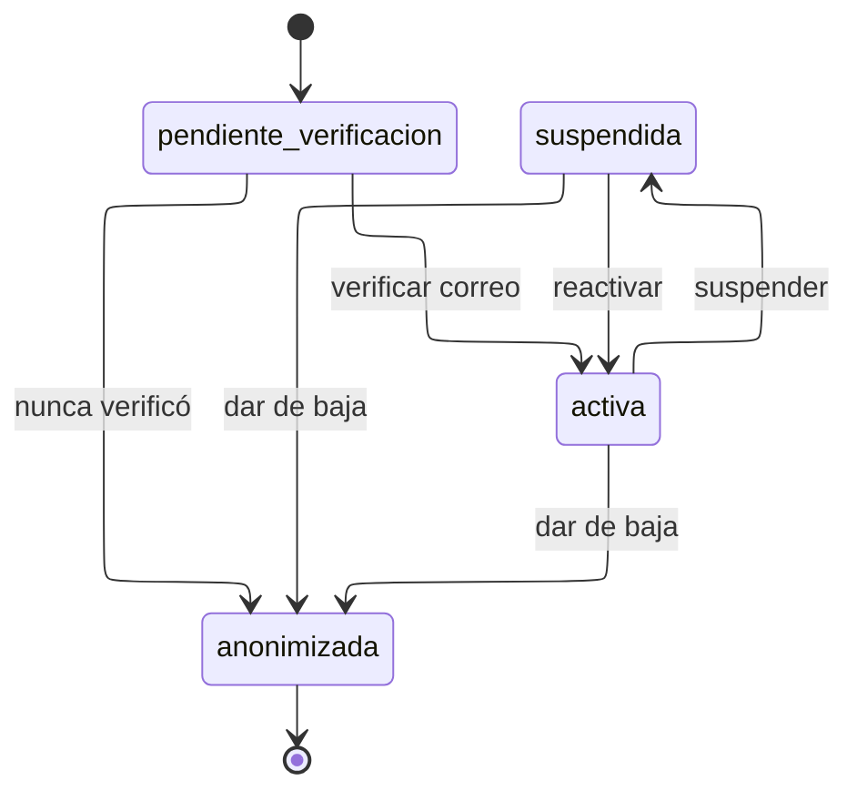

# Estados de cuenta

Cuatro estados. La baja no borra: anonimiza.

---

## Atributos semánticos

|          Estado          | `permite_ingreso` | `permite_inscripcion` | `visible_en_reportes` |
| :----------------------: | :---------------: | :-------------------: | :-------------------: |
| `pendiente_verificacion` |        Sí         |          No           |          Sí           |
|         `activa`         |        Sí         |          Sí           |          Sí           |
|       `suspendida`       |        No         |          No           |          Sí           |
|      `anonimizada`       |        No         |          No           |          Sí           |

`visible_en_reportes` es verdadero en los cuatro, y esa uniformidad es
deliberada: retirar del recuento a quien se dio de baja alteraría los reportes de
años ya cerrados.

---

## Transiciones

|                Transición                 |     Actor      | Motivo |                 Nota                  |
| :---------------------------------------: | :------------: | :----: | :-----------------------------------: |
|   `pendiente_verificacion` => `activa`    |  Participante  |   No   |  Exige al menos un perfil declarado   |
| `pendiente_verificacion` => `anonimizada` |    Sistema     |   No   |  Purga de cuentas nunca verificadas   |
|         `activa` => `suspendida`          | Administración |   Sí   |     Revoca las sesiones abiertas      |
|         `suspendida` => `activa`          | Administración |   Sí   |                                       |
|         `activa` => `anonimizada`         |     Ambos      |   Sí   | A solicitud de la persona o de oficio |

---

## Notas

**No hay transición de vuelta desde `anonimizada`.** Es terminal porque los datos
personales ya no existen: el nombre se sustituye, el correo se libera y los
identificadores se retiran. Lo que permanece son las participaciones, los puntos
y las constancias, sin nada que permita reidentificar a la persona.

**El paso a `activa` exige al menos un perfil.** Una cuenta sin perfil no puede
inscribirse en nada ni aparecer en ningún reporte segmentado, de modo que activar
sin perfil produciría una cuenta que existe y no sirve. Lo comprueba
`trg_usuario_perfil_minimo`.

**`suspendida` es reversible y `anonimizada` no.** Es la diferencia entre una
medida disciplinaria y una baja, y por eso son dos estados y no uno con un
booleano.
